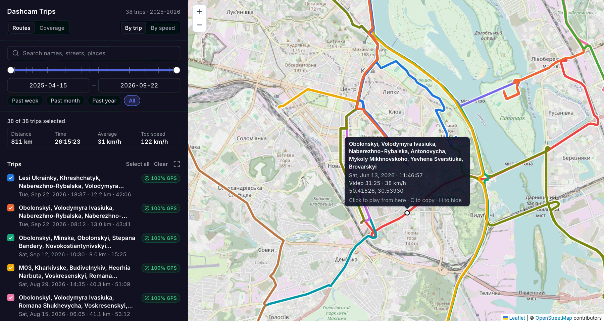

# dashcam-suite

A toolkit for importing, processing, and visualizing trips from a car dashcam. Uses the burnt-in GPS metadata for plotting and analyzing routes on a map.

[](https://github.com/YuriyGuts/dashcam-suite/actions/workflows/ci.yml) [](LICENSE)


## How it works

* Merges the raw short clips from the SD card into single trip videos, automatically detecting separate trips.
* Extracts the time / GPS metadata from the video frames and saves them to metadata files, automatically filtering out invalid/spoofed GPS data.
* Matches the route coordinates to street names from OpenStreetMap and automatically suggests trip names.
* Lets you browse your trips on a map in the Web browser, with the dashcam video playing in sync.



I wrote it for my own VIOFO A119 V3, and it only reads that camera's overlay for now. See [Assumptions](#assumptions) before you try it with anything else.


## Requirements

- Linux, macOS, or Windows.
- Python 3.12 or newer and [uv](https://docs.astral.sh/uv/).
- [FFmpeg](https://ffmpeg.org/) in `PATH`, built with `libx265`.


## Installation

```sh
uv tool install git+https://github.com/YuriyGuts/dashcam-suite
```

This puts the `dashcam` command on your `PATH`.

To upgrade later, run `uv tool upgrade dashcam-suite`.

## Configuration

All settings can be supplied via command line flags. You can also configure persistent settings in a TOML file:

- Linux: `~/.config/dashcam/config.toml`
- macOS: `~/Library/Application Support/dashcam/config.toml`
- Windows: `C:\Users\<you>\AppData\Local\dashcam\config.toml`

Set the `DASHCAM_CONFIG` environment variable to use a different file.

`dashcam config` prints the effective settings.

Here is a full config. The values are the defaults, except for `library_dir` and `raw_video_dir`, which depend on your machine:

```toml
# Where the merged, encoded trip videos will go.
# On Windows, escape backslashes in double quotes ("D:\\Videos\\Dashcam")
# or use single quotes ('D:\Videos\Dashcam').
library_dir = "~/Videos/Dashcam"

# The DCIM folder on the dashcam's SD card.
# Clips in its subfolders, such as locked clips in RO, are imported too.
raw_video_dir = "/media/me/DASHCAM/DCIM"

# The directory holding the track metadata.
# When specifying a relative path like below, it is relative to `library_dir`.
metadata_dir = ".metadata"

# Time zone of the camera clock.
timezone = "Europe/Kyiv"

# OpenStreetMap region for street names.
# Pick yours at https://download.geofabrik.de/.
osm_extract_url = "https://download.geofabrik.de/europe/ukraine-latest.osm.pbf"

# Added to suggested trip names as a suffix. Set to "" to leave it out.
car_model = ""

# A gap of at least this many hours between clips starts a new trip.
min_trip_gap_hours = 3

# GPS positions outside all of these boxes are discarded as spoofed.
# Each box is [min_lat, min_lon, max_lat, max_lon]. Empty allows anywhere.
# For example, Ukraine: [[44.0, 22.0, 52.5, 40.5]].
allowed_areas = []

# Number of trips encoded and videos extracted in parallel. Tune to your machine.
encode_job_count = 1
extract_job_count = 10

# FFmpeg and FFprobe binaries to run.
ffmpeg_executable = "ffmpeg"
ffprobe_executable = "ffprobe"

# Hardware decoding options. Off by default. Depending on your system, try:
# "-hwaccel vulkan" on Linux, "-hwaccel videotoolbox" on macOS,
# or "-hwaccel d3d12va" on Windows.
hwaccel_options = ""

# Video encoder settings. Keep `open-gop=0` so seeking stays fast in Firefox.
video_codec_options = "-c:v libx265 -crf 30 -preset fast -x265-params open-gop=0"

# Audio encoder settings.
audio_codec_options = "-c:a aac -b:a 128k"
```

## Getting started

Run `dashcam -h` for the list of available commands.

### Starting from scratch

If you haven't recorded anything yet, set up the camera first:

- Attach the GPS mount.
- Turn on the date/time and GPS stamps. The speed stamp is optional.
- Use km/h for the speed unit and the 24-hour clock.
- Record at 2560×1440 or 2560×1600.
- Set the camera clock to local time.

The clip length doesn't matter, since clips are merged anyway.

Then install the tool, write a config as shown above, and download the map data for your region once:

```sh
dashcam enrich --update-osm
```

You can skip it and still get tracks on a map. You won't get street names or name suggestions until it's done.

After a few drives, put the SD card in your computer and run:

```sh
dashcam import
```

It encodes the new trips into the library, extracts their tracks, matches them to streets, and then shows the suggested names. You can accept all of them, reject them, or go through them one by one. When it's finished, start browsing:

```sh
dashcam serve
```

Open http://127.0.0.1:8765/ in your browser.

### Processing an existing library

If you already have merged trip videos but no metadata, point `library_dir` at the folder (or pass `-d`) and run:

```sh
dashcam extract
dashcam enrich --update-osm
dashcam rename --suggest
dashcam serve
```

`extract` is the slow part: every video is decoded in full. It saves each track as soon as its video is done, so you can stop it and run it again later to continue where it left off.

`rename` only touches trips still named with autogenerated names like `YYYY-mm-dd Trip HH-MM`. Names you've given trips yourself stay as they are unless you pass `--all`.

The metadata goes into a hidden `.metadata` folder inside the library. Leave it next to the videos.

If what you have is an archive of raw clips rather than merged trips, encode them first:

```sh
dashcam encode trips --raw-video-dir ~/Archive/DashcamClips
```

Then continue with `extract` as above.

### Adding new recordings from the SD card

Insert the card and run:

```sh
dashcam import
```

Every step skips what's already done, so only the new trips get encoded and processed. If it gets interrupted, running it again picks up the rest.

The tool never deletes anything from the card. Clips that have already been imported are skipped, so you can clear the card whenever it suits you.

To look before doing anything, add `--dry-run`. It prints how the clips would be grouped into trips.

### Adding a single video

If you have **raw clips** (named like `20260925111707_000271.MP4`), copy them into an empty folder and encode them from there:

```sh
dashcam encode trips --raw-video-dir ~/Downloads/clips
dashcam extract
dashcam enrich
dashcam rename --suggest
```

If you have a **finished video**, copy it into the library and name it after the trip date:

- `2026-09-25 Trip 11-17.mp4` if you want a name suggested from the streets.
- `2026-09-25 Any name you like.mp4` to keep your own name.

Then run `dashcam extract`, `dashcam enrich` and, for the first form, `dashcam rename --suggest`.

## Other things you can do

**Encode a specific range of clips.** `dashcam encode range 15 319 --output-name "Road Trip"` merges clips 15 to 319 (the number after the underscore) into one video, even if they span several trips or have been imported before.

**Browse from a phone or TV.** `dashcam serve --host 0.0.0.0` makes the app reachable from your local network. Renaming from the web app is turned off in this mode. Add `--allow-rename` to turn it on for anyone on your network. Open the app by the computer's IP address or its `.local` name.

**Work with routes on the map.** Click a route to play its video from that spot. While hovering a route, press C to copy the point's time, speed and coordinates, or H to hide the trip, e.g. when several trips share a street.

**Rename trips.** Click the trip name in the web app's trip details to edit it. The street-based suggestion is one click away. You can also rename files in Finder or your file manager. The next `dashcam extract` (or `dashcam doctor --fix`) recognizes a renamed video by its content and moves its track along, without reading the video again.

**Delete a trip.** Delete the video. Its track stays in the metadata as "unreachable" and still shows on the map, without video. `dashcam forget "<file name>"` moves the track to `.metadata/trash/` too.

**Check the library.** `dashcam status` lists trips, videos without tracks, `no_overlay` videos and unreachable tracks. `dashcam doctor` looks for inconsistencies in the metadata, and `dashcam doctor --fix` repairs the safe ones.

**Update the map data.** Run `dashcam enrich --update-osm` again. It re-matches the tracks against the new data. To build the data from a `.osm.pbf` file you already have, use `--osm-file`.

### Advanced

**Fix a bad GPS stretch by hand.** Open the track in `.metadata/tracks/` and list the ranges in video seconds:

```json
"overrides": {"bad_ranges_s": [[610, 1340]], "good_ranges_s": []}
```

Then run `dashcam extract --reclean` and `dashcam enrich`.

**Keep the metadata elsewhere.** Set `metadata_dir` to an absolute path, for example when the library is on a read-only share or a slow NAS.


## Assumptions

The tool was built around one camera and has only been tested with its footage. It will work for you only if all of the following are true.

**The overlay uses the VIOFO A119 V3 font.** Text is read by matching each character against templates of this camera's font along the bottom edge of the frame. For example:

```
46 KM/H N49.810205 E24.028992          VIOFO A119 V3          2026/09/23 18:42:06
```

The position, order and spacing of the values don't matter, and neither do other texts such as the model name. The tool tries to be robust to different value formats.

**The video is at least 1280 pixels wide.** The tool is tested with 2560-pixel-wide recordings and with copies scaled down to 1280 pixels. Narrower videos are treated as having no overlay. Cropped videos and other recording resolutions are untested.

**The burnt-in overlay is the only GPS source.** GPS data that may be embedded in the original SD card files is ignored.

**Raw clips are named `YYYYMMDDhhmmss_NNNNNN.MP4`.** That is, start time and index. For other names, the tool looks for a trailing number to use as the index and takes the start time from the file's modification time. Files without a number are skipped, and so are parking mode clips (`YYYYMMDDhhmmss_NNNNNNP.MP4`).

**The camera clock is in one time zone**, set by `timezone`. Daylight saving time is handled. Trips abroad are recorded with your home time zone's offset.

**Street names work best in Ukraine.** Matching works with any OSM extract. Suggested names use the English name from OSM when there is one. Otherwise they use Ukrainian transliteration and drop Ukrainian and English street-type words. In other countries you may get untidy names, and you can always edit them.


### Using another camera

Supporting another camera means teaching the OCR module about the camera's text overlay.

`docs/SPEC.md` describes the whole design in detail.


## Development

```sh
git clone https://github.com/YuriyGuts/dashcam-suite
cd dashcam-suite
uv sync
uv run dashcam --help
uv run pytest
uv run ruff check && uv run ruff format --check
uv run ty check
```

`docs/SPEC.md` is the design document: file formats, cleaning rules, matching and what each command does. Keep it in sync when behavior changes.

To let Claude Code test the web app in a browser, add the Playwright MCP server:

```sh
claude mcp add playwright -- npx @playwright/mcp@latest --browser firefox --output-dir .local/.playwright-mcp
```

## License

MIT. See [LICENSE](LICENSE).

The web app bundles [Leaflet](https://leafletjs.com/) (BSD 2-Clause), [Leaflet.heat](https://github.com/Leaflet/Leaflet.heat) (BSD 2-Clause) and the [Inter](https://rsms.me/inter/) font (SIL Open Font License). Their licenses are in `src/dashcam/web/vendor/`.

Map tiles and street data come from [OpenStreetMap](https://www.openstreetmap.org/copyright) contributors and are available under the Open Database License.
